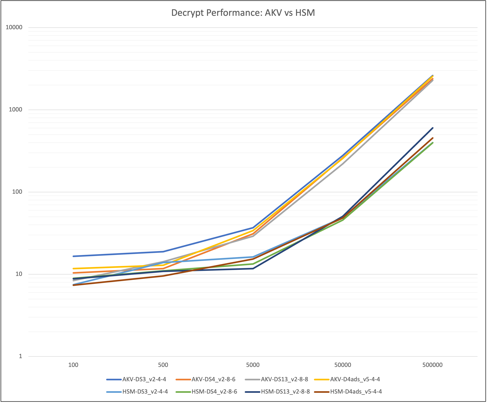

# Data Encryption using Azure Key Vault / Managed HSM via Spark UDFs

### What's in this repository?

Inside this repository you will find the following artifacts:

* Sample Java Library that implements an encryption and decryption class that leverages Azure Key Vault and Azure Managed HSM, and relevant pom file for compiling the source code ([./src/main/java/com/microsoft/solutions/keyvaultcrypto](./src/main/java/com/microsoft/solutions/keyvaultcrypto))
* Sample Notebook that will attempt to register the UDF and do some quick encryption and decryption ([./notebook/PySparkJavaUDFEncryptionSample.ipynb](./notebook/PySparkJavaUDFEncryptionSample.ipynb))

### Problem Statement

When working with data in Apache Spark, there are limited capabilities (or, in older versions of Spark, no capabilities) for encrypting data. Often, strong, cipher-backed encryption requires the use of other capabilities that need to be appended to or made available to your Spark compute node(s).

This code repository was created to show one potential solution that uses Azure-native solutions for encrypting your data using cryptographic operations of Azure Key Vault and Azure Managed HSM, by using Spark UDFs.


### Solution Architecture

If you're running your Spark workloads in Azure, or you have a hybrid scenario where Spark workloads can run in on-premises compute as well as Azure, there are ways to leverage the cryptographic capabilities of Azure Key Vault (https://learn.microsoft.com/en-us/azure/key-vault/general/overview) and Azure Managed HSM (https://learn.microsoft.com/en-us/azure/key-vault/managed-hsm/overview) for encrypting and decrypting your data with secure and strong ciphers. This can be achieved via extending Spark UDFs written in Java.

The core functionality of the Java code is meant to extend the "UDF2" class of the ```org.apache.spark.sql.api.java``` library, which in turn can be used to implement both the Azure Identity (https://learn.microsoft.com/en-us/java/api/overview/azure/identity-readme?view=azure-java-stable) and Azure Key Vault (https://learn.microsoft.com/en-us/java/api/overview/azure/key-vault?view=azure-java-stable) SDKs for connecting to the cryptographic APIs of the Key Vault or Managed HSM service  to do the encryption and decryption of a column's value.

When data is to be encrypted, the library should connect to a cryptographic provider and retrieve the public contents of a key that supports the chosen encryption algorithm. This public key material is cached locally and used to asymmetrically encrypt the value provided to the cipher. The returning encrypted value is converted to base64 and returned as the value from the UDF. Since this happens locally, it is incredible fast to encrypt large amounts of data.

To decrypt data, a similar process is employed however since no private key information can leave the Key Vault or Managed HSM, each value to be decrypted relies on a remote call to service that was used to encrypt it.

### Important: Before you begin

This sample code and contained classes are designed to give you a starting point of how you would accomplish these cryptographic operations using Spark. Note that these are just starting points; this code is not designed ot be run in production. Things like proper exception handling and tests would still need to be provided.


### Core Components

* A Managed Spark Environment, such as:
  * Azure Databricks
  * Azure Synapse Spark Pools
* An Azure Cryptographic Tool, either:
  * Azure Key Vault
  * Azure Managed HSM
* Network Connectivity between your Spark compute engine and the chosen Cryptographic tool
* An Azure Service Principal

### Performance

Spark UDFs can be costly in terms of performance, as this is a a scalar operation designed to run on each value in a dataset/dataframe. Therefore, it's important that any UDF-based approach be designed to scale with the nature of Spark. By extending the ```UDF``` API (https://spark.apache.org/docs/3.1.3/api/java/org/apache/spark/sql/api/java/UDF2.html), you can make sure that your data can processed in parallel. That said, your normal Spark performance considerations apply:

* How is your data partitioned? 
* Will data need to be shuffled?
* More executors do not always equal more performance, as the more workers you have the more work your driver has to manage
* Since decryption operations require a call per value to the given cryptographic provider, latency can also be a factor, as well as API limits (see below)

To provide a baseline of what kind of performance you can expect, this solution was tested using Azure Databricks under different cluster sizes and compute SKUs. It was also tested against Azure Key Vault and Azure Managed HSM against different record set sizes of 100, 500, 5000, 50000, and 500000 rows, with average runtimes graphed and charted below.


| Provider | Compute SKU | Cores Per Worker | Memory (GB) | Worker Nodes | 100     | 500    | 5000   | 50000  | 500000  |
| ---      | ---         | ---              | ---         | ---          | ---     | ---    | ---    | ---    | ---     |
| AKV      | DS3_v2      | 4                | 14          | 4            | 16.5s   | 18.8s  | 36.71s | 277.2s | 2610.6s |
| AKV      | DS4_v2      | 8                | 28          | 6            | 10.38s  | 11.72s | 31.1s  | 259.8s | 2389.8s | 
| AKV      | DS13_v2     | 8                | 56          | 8            | 8.36s   | 14.2s  | 29.04s | 220.2s | 2279.4s | 
| AKV      | D4ads_v5    | 4                | 16          | 4            | 11.73s  | 12.85s | 33.9s  | 256.8s | 2565s   |
| HSM      | DS3_v2      | 4                | 14          | 4            | 7.45s   | 13.85s | 16.25s | 48.85s | 398.4s  |
| HSM      | DS4_v2      | 8                | 28          | 6            | 8.92s   | 11s	  | 13.35s | 45.59s | 397.2s  | 
| HSM      | DS13_v2     | 8                | 56          | 8            | 8.8s    | 10.85s | 11.7s  | 50.49s | 601.8s  |
| HSM      | D4ads_v5    | 4                | 16          | 4            | 7.34s   | 9.52s  | 15.28s | 48.29s | 453.6s  |



**Data Source**: This data was compiled using a 500,000 row dataset from the public data source "Citi Bike NYC" (https://citibikenyc.com/system-data), partitioned by the column "Started At" cast as a date (from datetime). Multiple runs across the different vault services, compute SKUs, and worker counts were run multiple times arrive at median times.

### Cost

Azure Key Vault and Managed HSM charge per 10,000 cryptographic operations. Cryptographic operations can be viewed here: https://learn.microsoft.com/en-us/azure/key-vault/keys/about-keys-details#key-operations. For more detailed pricing of the different services in these offerings, please refer to the Azure Key Vault pricing details here: https://azure.microsoft.com/en-us/pricing/details/key-vault/

## Deploying This Solution

### Creating a Service Principal and Assign Permissions

This solution relies on the ```DefaultAzureCredentialBuilder``` class of the Azure Identity Java SDK (https://learn.microsoft.com/en-us/java/api/com.azure.identity.defaultazurecredentialbuilder?view=azure-java-stable) to authenticate to Azure Key Vault / Azure Managed HSM resources for cryptographic operations, specfically the use of environment variables (https://learn.microsoft.com/en-us/java/api/com.azure.identity.environmentcredential?view=azure-java-stable). Before getting started you should create a service principal and a client secret. Note these values down after you create them. More details can be found here: https://learn.microsoft.com/en-us/azure/active-directory/develop/howto-create-service-principal-portal

Once you have your service principal created, you will need to apply an access policy or RBAC role for the principal. The required operations of this example that you should provide are:

* Get Key
* List Keys
* Encrypt
* Decrypt

For Managed HSM, you should give the principal the following role:

* Managed HSM Crypto User

### Compiling the JAR

The included ```src``` folder and .pom file should have everything you need to get started with this example. This sample solutiuon takes dependancies on the ```com.azure.identity.*``` and ```com.azure.security.keyvault.keys.cryptography.*``` libraries.

### Adding the JAR/Classes to your Classpath

Once compiled, you will need to provide the JAR to your Java classpath. This will vary depending on where you are planning to use Spark. For more detailed information about making your JARs available in various Azure managed Spark environments, please refer to the following documentation:

* Azure Databricks - Add Workspace Library: https://learn.microsoft.com/en-us/azure/databricks/libraries/workspace-libraries
* Azure Synapse - Manage libraries for Apache Spark in Azure Synapse Analytics: https://learn.microsoft.com/en-us/azure/synapse-analytics/spark/apache-spark-azure-portal-add-libraries

### Configure your Spark Environment Variables

Next, you'll need to add your environment variables for your service principal. This will vary depending on your platform. In the end, the following environment variables need to be set:

* AZURE_TENANT_ID (Your Azure Tenant ID)
* AZURE_CLIENT_ID (Your Service Principal Client Id)
* AZURE_CLIENT_SECRET (The secret your created when you created your service principal)

To set these variables, please refer to your managed Spark platform in Azure:

* Azure Databricks: https://learn.microsoft.com/en-us/azure/databricks/kb/clusters/validate-environment-variable-behavior
* Azure Synapse Environment Variables: https://learn.microsoft.com/en-us/azure/synapse-analytics/spark/apache-spark-azure-create-spark-configuration

If you are running locally or remotely, you can set this as you set any local system environment variables.

### Register the UDF(s)

After your Spark cluster has started, the UDF needs registered, you can do that with the following two commands:

```python
from pyspark.sql.functions import col, udf, expr
from pyspark.sql.types import StringTypespark.udf.registerJavaFunction("encrypt", "com.microsoft.solutions.keyvaultcrypto.doEncryption", StringType())

spark.udf.registerJavaFunction("encrypt", "com.microsoft.solutions.keyvaultcrypto.doEncryption", StringType())
spark.udf.registerJavaFunction("decrypt", "com.microsoft.solutions.keyvaultcrypto.doDecryption", StringType())
```

### Encrypting Data

Once the libraries are available to your Spark engine, and your UDFs are registered, you can now encrypt data. You can use PySpark or the SparkSQL engine to handle encryption operations:

PySpark:

```python
# ... assuming df is a data frame with a column we want to encrypt
# we can use the UDF in combination with expr() to pass in the column you want to encrypt, and the key URI you want to use.
encrypted_df = df.withColumn("EncryptedColumn", expr("encrypt(<column name>,'https://<keyvault or hsm url>/keys/<key name>/<key version>')"))
```

Spark SQL:

```sql
-- similar to above; use the UDF in a Spark SQL statement, substituting URIs, columns, and key names and versions as needed
SELECT *, encrypt([column name],'https://<keyvault or hsm url>/keys/<key name>/<key version>') as encryptedColumn from [table or view name]
```

Encrypting data should be relativley quick as the public key contents, once retrieved from the vault or HSM, are cached locally and all operations are performed locally.

### Decrypting Data

Decrypting data works much the same way:

PySpark:

```python
# ... assuming df is a data frame with a column we want to decrypt
# we can use the UDF in combination with expr() to pass in the column you want to decrypt, and the key URI you want to use.
dencrypted_df = encrypted_df.withColumn("DecryptedColumn", expr("decrypt(<column name>,'https://<keyvault or hsm url>/keys/<key name>/<key version>')"))
```

Spark SQL:

```sql
-- similar to above; use the UDF in a Spark SQL statement, substituting URIs, columns, and key names and versions as needed
SELECT *, encrypt([column name],'https://<keyvault or hsm url>/keys/<key name>/<key version>') as encryptedColumn from [table or view name]
```

These operations require a per-row operation to call the remote Key Vault / HSM for the decryption process, and performance will vary (see "Performance" above for more details).

## Additional Considerations

**Choosing an Encryption Key Cipher / Key Type**

The example code contained in this repository is hard-coded to use non-HSM backed RSA cipers (RSA1_5). Your encryption algorithm in your class should match your key type in your Vault/HSM. You can also consider making this something you provide as part of the UDF call as well. Note that your chosen encryption algorithms also vary based on Vault/HSM type. Please see this page for details on supported key types per product: https://learn.microsoft.com/en-us/azure/key-vault/keys/about-keys

**API Rate Limiting**

Because these methods rely on external APIs for cryptographic operations, your code should take into account HTTP 429 responses and implement appropriate retry logic where needed. The example code does a rudimentary job of this. More information about rate limiting and retry scenarios can be found here: https://learn.microsoft.com/en-us/azure/key-vault/general/overview-throttling 

**Exception Handling and Logging**

The code examples here do not implement robust error handling and logging, outside of general exception trapping. Your code should implement appropriate handling of authentication, HTTP respose, and any specific Vault/HSM exceptions that could be thrown. Additionally, consider adding logging via Log4j or some other available service for your production code.

**Private Endpoint Connectivity**

If you plan to secure your Key Vaults and/or HSMs behind private endpoints on your Azure virtual networks, please make sure your Spark driver and worker nodes have connectivity to those endpoints. Otherwise, you may get HTTP 403 exceptions.

## Contributing

This project welcomes contributions and suggestions.  Most contributions require you to agree to a
Contributor License Agreement (CLA) declaring that you have the right to, and actually do, grant us
the rights to use your contribution. For details, visit https://cla.opensource.microsoft.com.

When you submit a pull request, a CLA bot will automatically determine whether you need to provide
a CLA and decorate the PR appropriately (e.g., status check, comment). Simply follow the instructions
provided by the bot. You will only need to do this once across all repos using our CLA.

This project has adopted the [Microsoft Open Source Code of Conduct](https://opensource.microsoft.com/codeofconduct/).
For more information see the [Code of Conduct FAQ](https://opensource.microsoft.com/codeofconduct/faq/) or
contact [opencode@microsoft.com](mailto:opencode@microsoft.com) with any additional questions or comments.

## Trademarks

This project may contain trademarks or logos for projects, products, or services. Authorized use of Microsoft 
trademarks or logos is subject to and must follow 
[Microsoft's Trademark & Brand Guidelines](https://www.microsoft.com/en-us/legal/intellectualproperty/trademarks/usage/general).
Use of Microsoft trademarks or logos in modified versions of this project must not cause confusion or imply Microsoft sponsorship.
Any use of third-party trademarks or logos are subject to those third-party's policies.